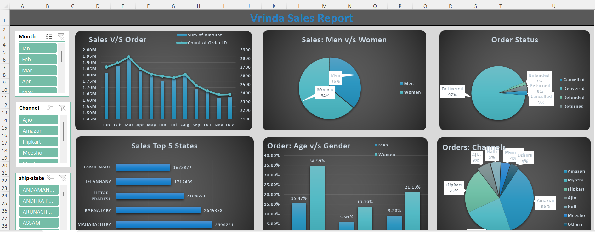
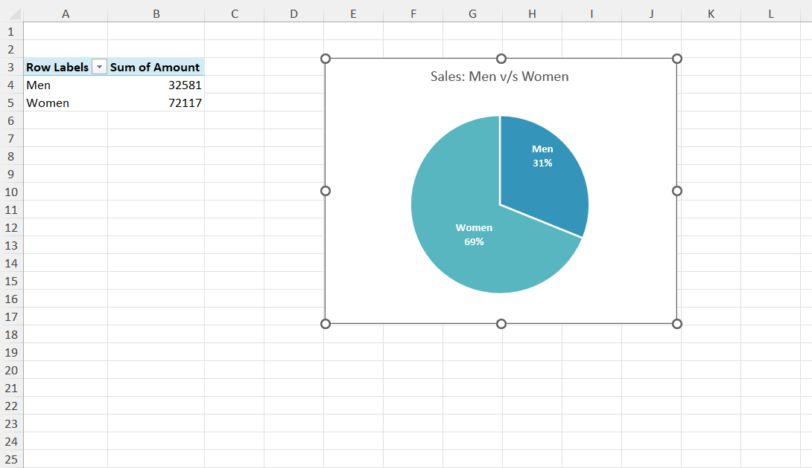

# 📊 Vrinda Sales Analysis (Excel Dashboard)

## 📌 Project Overview

This project focuses on analyzing sales data of Vrinda Store using Microsoft Excel. The goal is to uncover insights related to customer behavior, sales performance, and order trends through an interactive dashboard.

---

## ❓ Problem Statement

The business faces difficulty in understanding:

* Monthly sales trends and order patterns
* Customer demographics (age & gender contribution)
* Top-performing states and sales regions
* Sales distribution across different channels (Amazon, Flipkart, Myntra, etc.)
* Order status insights (Delivered, Cancelled, Returned, Refunded)

This project aims to solve these challenges using data visualization techniques in Excel.

---

## 🛠️ Tools & Techniques Used

* Microsoft Excel
* Pivot Tables
* Pivot Charts
* Slicers & Filters
* Data Cleaning & Transformation

---

## 📊 Dashboard Features

* **Sales vs Orders Analysis (Monthly Trends)**
* **Sales Distribution: Men vs Women**
* **Order Status Breakdown**
* **Top 5 States by Sales**
* **Age Group vs Gender Analysis**
* **Sales by Channels (Amazon, Flipkart, Myntra, etc.)**

---

## 🔍 Key Insights

* Women contribute significantly higher sales compared to men
* Majority of orders are successfully delivered (~90%+)
* Maharashtra and Karnataka are top-performing states
* Amazon and Myntra are the leading sales channels
* Adult age group dominates the order volume

---

## 🖼️ Dashboard Preview

### Main Dashboard



### Men & Women



---

## 📁 Project Structure

```
vrinda-analysis/
│
├── data/
│   └── vrinda_dataset.csv
│
├── dashboard/
│   └── vrinda_dashboard.xlsx
│
├── images/
│   ├── dashboard_view.png
│   └── charts.png
│
└── README.md
```

---

## ▶️ How to Use

1. Download the Excel file from the **dashboard/** folder
2. Open in Microsoft Excel
3. Use slicers (Month, Channel, State) to interact with the dashboard

---

## 📌 Dataset

The dataset used in this project contains sales transaction details including:

* Order ID
* Customer demographics
* Product category & size
* Sales amount
* Order status
* Shipping details

---

## 🚀 Future Improvements

* Add advanced KPIs (Revenue Growth, Conversion Rate)
* Integrate Power BI version of the dashboard
* Automate data updates

---

## 🙌 Acknowledgment

This project is created as part of my data analytics learning journey.

---
